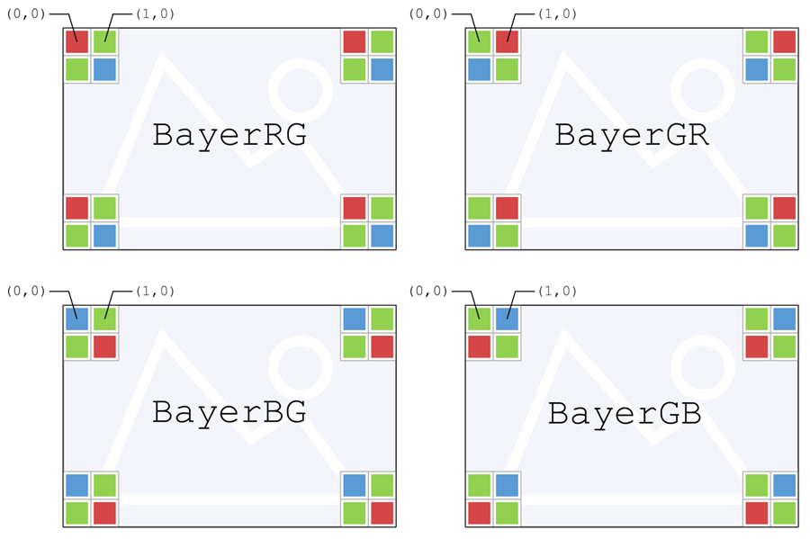
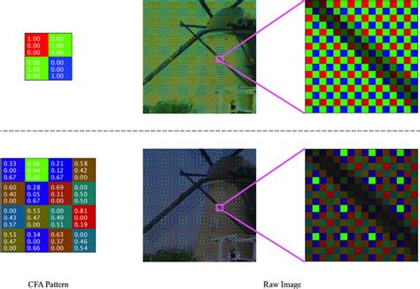

# 为什么我的 /image_raw 是绿色的？

最近在给大恒相机写驱动，为后续标定和与激光雷达融合作准备，在开发中遇到了一些问题

看图说话

<p align="center">
  
</p>
<p align="center"><em>图 1  大恒 Galaxy 工业相机 ROS2 驱动效果</em></p>


可以看到驱动输出的画面绿油油的，透漏着一丝诡异，其实这画面我一开始在官方的 GalaxyView 里面就看到过，如下图，也是绿油油的

<p align="center">
  
</p>
<p align="center"><em>图 2  大恒 GalaxyView 驱动效果</em></p>

当时我也没多想，最后在写驱动的时候感觉不太对劲儿，因为对比海康相机还有迈德相机相比他们的画面就是正常的RGB显示，那这是为什么呢？

要解释这个问题就得从工业相机传感器的底层原理开始讲起

现在绝大多数彩色工业相机（如 BayerRG8 格式）的传感器表面覆盖着一层 Bayer 滤光片。它的排列方式通常是 RGGB（红-绿-绿-蓝），就像下面这样

Plaintext

```
R G R G R G
G B G B G B
R G R G R G
```


<p align="center">
  
</p>
<p align="center"><em>图 3 BayerRG、BayerGR、BayerBG 和 BayerGB 之间的差异</em></p>

从[上面这个图](https://www.1stvision.com/cameras/IDS/IDS-manuals/en/basics-raw-bayer-pixel-formats.html)可以知道，不管是哪种 Bayer 格式，绿色像素占比 50%，红色和蓝色像素各占 25%，传感器输出的那东西，本质上连“彩色图像”都算不上，只是带颜色滤镜的亮度测量。大概就像下面这样，可以看到和我的相机输出图像比较相似（我的分辨率更高）

<p align="center">
  
</p>
<p align="center"><em>图 4 Bayer pattern</em></p>


和手机、单反不同，绝大多数工业相机没有内置的 ISP（图像信号处理器），或者 ISP 默认是关的。那么当驱动程序从相机拿到数据并进行基础的去马赛克转换为 RGB 图像时，如果不做白平衡处理，那么绿色通道的能量本身就是红/蓝通道的 2 倍，绿色通道得到的信息最多，信号量最大，红、蓝通道插值、信息少，看起来比较弱，再加上没有白平衡，G 的增益没压下去，R/B 没抬上来

所以图像整体呈现偏绿、偏灰、不通透，暗部发闷。

我在驱动里面读取 Bayer RAW，然后按真实 Bayer 排列插值成 RGB24，做了区马赛克操作但是没有做白平衡之类的操作。

所以发布的 /image_raw 已经是 3 通道 bgr8 图像，但没有做 ISP，显示出来就会偏绿、偏灰，看起来不好看，但几何上是正确的。这完全不会影响标定操作，因为这只是像素值上的操作，没有改变任何像素的位置。

海康相机 SDK 出来的画面之所以真实自然其实是因为默认把整个ISP 都做了，什么去马赛克，白平衡、曝光、Gamma、颜色矩阵之类的。

所以严格意义上来说海康的 /image_raw，已经不是原始图像了。

但是吧，/image_raw 通俗的理解他就是 **未经几何变换 + 未压缩的像素数据** ，只要满足这两个条件都可以叫做 /image_raw ,也就是不用care你的颜色怎么怎么样，只要不被裁剪、不被缩放、不被去畸变、不被叠加文字水印，几何投影保持原样就OK

相机标定依赖的是几何特征也就是角点的位置，完全不关心颜色，白平衡、Gamma 都不影响角点检测。相反，如果 ISP 做了畸变矫正或缩放，反而会破坏标定。

关于这个 /image_raw [ROS官方也没有一个及其严格准确的定义](https://docs.ros.org/en/jade/api/sensor_msgs/html/msg/Image.html)，但是作为驱动程序，设计之初应该认真考虑对于广泛下游任务良好有效的支持，方便后续下游任务开发者针对自己的任务有效使用 /image_raw 。

相较于海康等相机的 /image_raw 其实按道理来说 现在这个 DAHENG相机给出的这种具有鲜明原始特性的 /image_raw 对下游任务具有更加广泛的支持，最简单的例子就是 做 SLAM 的时候，自动白平衡和自动 Gamma 往往会导致同一物体在不同角度亮度剧烈变化，这会干扰 SLAM 的特征追踪，但是这种绿油油的可以有效保证光度一致性
